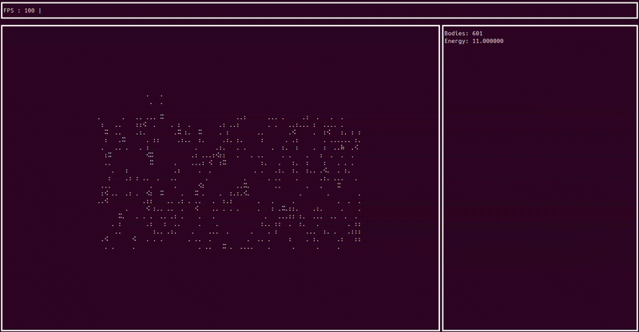

# N-Body Simulation

N-Body physics simulation with rendering in the terminal.



## Installation

> **Important:** unfortunately this program can only be run on Linux. If you use Windows, you can run it inside [WSL](https://learn.microsoft.com/en-us/windows/wsl/install).

## Run an Example

```bash
./build/sim
```

## Building

```bash
cmake .. -DCMAKE_BUILD_TYPE=Release
make -j$(nproc)
```

## Creating Your Own Scenarios

You can create a YAML config file for your custom scenario. Examples of these configs can be found in the `/scenarios` folder.

The basic structure is like this:

```yaml
scenario: custom  # indicate that this is a custom scenario
name: "your name"
G:  # gravitational constant
dt: # time interval
bodies:
  - mass:   # in kg
    pos:    # in m from center
    vel:    # in m/s
    acc:    # in m/s^2
    radius: # in m
```

## TODOs

- [ ] Add energy level visualization to the right window
- [ ] Add collisions and merging of bodies into one
